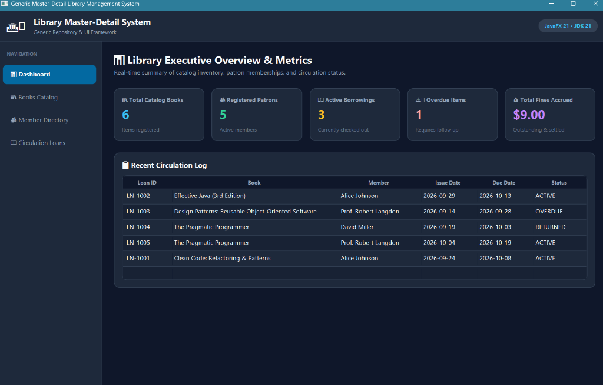
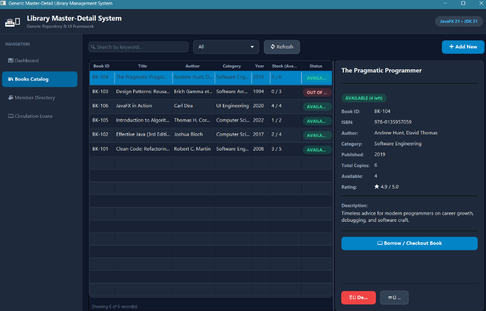
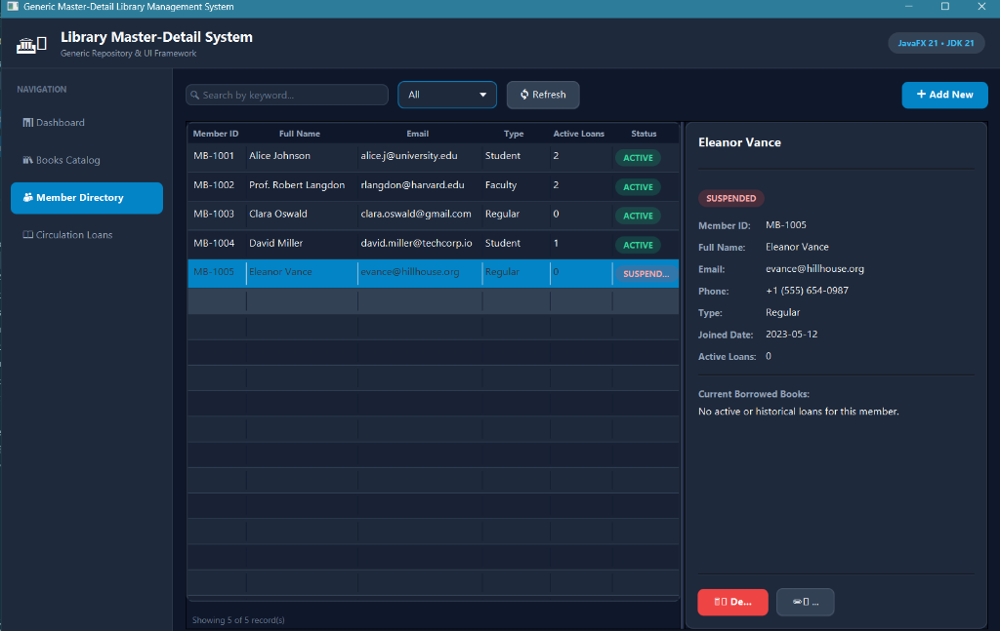
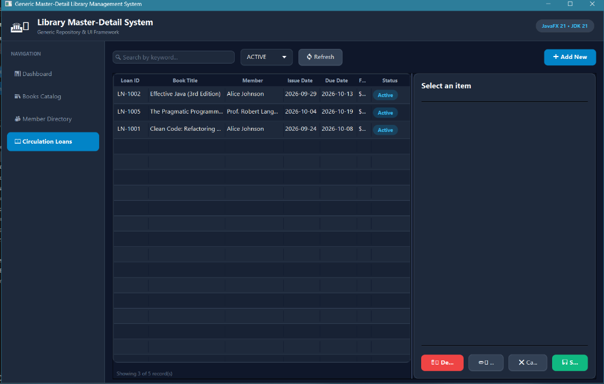
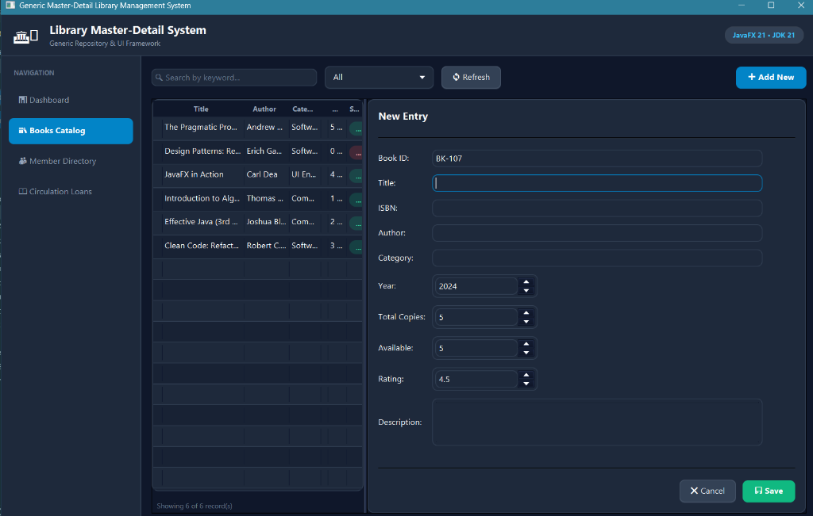

# 🏛️ Library Master-Detail System

> A full-featured **JavaFX 21 Desktop Application** demonstrating a **Generic Repository Pattern** and a **Reusable Master-Detail UI Framework** — built for a library management domain.

[](https://openjdk.org/projects/jdk/21/)
[](https://openjfx.io/)
[](https://maven.apache.org/)
[](LICENSE)

---

## 📸 Application Screenshots

### 📊 Dashboard — Executive Overview

> Live metric cards showing total books (6), registered patrons (5), active borrowings (3), overdue items (1), and total fines accrued ($9.00). Includes recent circulation history log.

---

### 📚 Books Catalog — Master-Detail View

> Full book catalog with searchable/filterable master table on the left and a rich detail panel on the right. Features color-coded availability badges and direct checkout action button.

---

### 👥 Member Directory — Patron Management

> Comprehensive member directory supporting Students, Faculty, and Regular patrons with status indicators (`ACTIVE`, `SUSPENDED`) and loan history tracking.

---

### 📖 Circulation Loans — Loan Tracking

> Active borrowing records displaying issue dates, due dates, loan status, and fine accrual indicators.

---

### ➕ New Entry Form — Record Creation Dialog

> Clean modal dialog overlay for adding new books, members, or loans into the system with auto-generated primary keys.

---

## 🎯 Project Overview

This project is a **desktop library management system** that showcases two powerful software engineering patterns:

| Pattern | Description |
|---|---|
| **Generic Repository** | A single `GenericRepository<T, ID>` interface handles CRUD for any entity — Books, Members, and Loans — without code duplication |
| **Template Method (Master-Detail UI)** | An abstract `MasterDetailView<T, ID>` class provides the complete UI scaffolding; concrete subclasses only implement domain-specific logic |

The entire application runs **in-memory** (no database required) using a thread-safe `ConcurrentHashMap` as the backing store, making it instantly runnable out of the box.

---

## 🛠️ Tech Stack

| Technology | Version | Purpose |
|---|---|---|
| Java | 21 (LTS) | Language — uses records, switch expressions, lambdas |
| JavaFX | 21.0.2 | Desktop UI framework (Controls, FXML, Graphics) |
| Apache Maven | 3.x | Build tool, dependency management |
| OpenJFX Maven Plugin | 0.0.8 | `mvn javafx:run` launcher |

---

## 📁 Project Structure

```
library-master-detail/
├── pom.xml
├── README.md
├── docs/
│   └── screenshots/
└── src/
    └── main/
        ├── java/com/library/
        │   ├── MainApp.java                     ← JavaFX Application entry point
        │   ├── model/
        │   │   ├── BaseEntity.java              ← Generic ID interface
        │   │   ├── Book.java                    ← Book entity
        │   │   ├── Member.java                  ← Patron entity
        │   │   ├── Loan.java                    ← Checkout record entity
        │   │   └── LoanStatus.java              ← Enum: ACTIVE / OVERDUE / RETURNED
        │   ├── repository/
        │   │   ├── GenericRepository.java       ← CRUD interface (generic)
        │   │   └── InMemoryRepository.java      ← HashMap-backed implementation
        │   ├── service/
        │   │   └── LibraryService.java          ← Business logic + data seeding
        │   └── ui/
        │       ├── MasterDetailView.java        ← Abstract base UI layout
        │       ├── DashboardView.java           ← Dashboard with metric cards
        │       ├── BookMasterDetailView.java    ← Books CRUD screen
        │       ├── MemberMasterDetailView.java  ← Members CRUD screen
        │       └── LoanMasterDetailView.java    ← Loans CRUD screen
        └── resources/
            └── styles/
                └── app.css                      ← Dark theme stylesheet
```

---

## 📦 Package & Class Reference

### `com.library` — Application Root

#### `MainApp.java` — JavaFX Entry Point

**Responsibility:** Bootstraps the entire application. Builds the shell UI (header + sidebar + center panel), instantiates all services and views, and wires the navigation system.

```java
public class MainApp extends Application {
    private LibraryService libraryService;   // Single shared service instance
    private BorderPane mainLayout;           // Root layout

    @Override
    public void start(Stage primaryStage) {
        libraryService = new LibraryService();   // Seeds in-memory data
        mainLayout = new BorderPane();
        mainLayout.setTop(buildHeader());        // Dark branded header bar
        mainLayout.setLeft(buildSidebar());      // 4-button navigation sidebar
        showDashboardView();                     // Default landing screen
        primaryStage.setScene(new Scene(mainLayout, 1280, 800));
        primaryStage.show();
    }
}
```

| Method | What it does |
|---|---|
| `buildHeader()` | Creates top HBox with logo, title, subtitle, and tech badge |
| `buildSidebar()` | Creates 4 navigation buttons wired to view-switch methods |
| `setActiveNavButton(btn)` | Manages CSS `nav-button-active` class across all nav buttons |
| `showDashboardView()` | Refreshes and sets DashboardView as the center panel |
| `showBooksView()` | Calls `bookView.refreshData()` and sets it as center |
| `showMembersView()` | Calls `memberView.refreshData()` and sets it as center |
| `showLoansView()` | Calls `loanView.refreshData()` and sets it as center |

---

### `com.library.model` — Domain Entities

#### `BaseEntity.java` — The Generic ID Contract

**Responsibility:** A generic interface that enforces a unified identity contract across all domain objects. This is the cornerstone of the Generic Repository pattern.

```java
public interface BaseEntity<ID> {
    ID getId();
    void setId(ID id);
}
```

> **Result:** `Book`, `Member`, and `Loan` all implement `BaseEntity<String>`, enabling the same `InMemoryRepository<T, ID>` class to store all three types.

---

#### `Book.java` — Book Domain Entity

**Responsibility:** Represents a single book title. Tracks inventory (total/available copies) and metadata.

```java
public class Book implements BaseEntity<String> {
    private String id;             // "BK-101" — primary key
    private String title;          // "Clean Code: Refactoring & Patterns"
    private String isbn;           // "978-0132350884"
    private String author;         // "Robert C. Martin"
    private String category;       // "Software Engineering"
    private int publicationYear;   // 2008
    private int totalCopies;       // 5
    private int availableCopies;   // 3 — changes on checkout/return
    private double rating;         // 4.8 / 5.0
    private String description;

    public boolean isAvailable() { return availableCopies > 0; }
}
```

> `isAvailable()` drives both the UI badge color and the checkout business rule.

---

#### `Member.java` — Library Patron Entity

**Responsibility:** Represents a registered library member. Tracks membership type and account status.

```java
public class Member implements BaseEntity<String> {
    private String id;              // "MB-1001"
    private String name;            // "Alice Johnson"
    private String email;
    private String phone;
    private String membershipType;  // "Student" | "Faculty" | "Regular"
    private LocalDate joinDate;
    private int activeLoansCount;   // Incremented/decremented by LibraryService
    private String status;          // "ACTIVE" | "SUSPENDED"
}
```

> A `SUSPENDED` member cannot borrow books. `activeLoansCount` is kept synchronized by `LibraryService` on every checkout and return.

---

#### `Loan.java` — Checkout Record Entity

**Responsibility:** Represents a book-borrowing transaction. Links a `Book` to a `Member` with date and fine tracking.

```java
public class Loan implements BaseEntity<String> {
    private String id;           // "LN-1001"
    private String bookId;       // FK → Book.id
    private String bookTitle;    // Denormalized (avoids lookups in UI table rows)
    private String memberId;     // FK → Member.id
    private String memberName;   // Denormalized
    private LocalDate issueDate;
    private LocalDate dueDate;
    private LocalDate returnDate; // null until returned
    private LoanStatus status;   // ACTIVE / OVERDUE / RETURNED
    private double fineAmount;   // $1.50/day when overdue
}
```

> `bookTitle` and `memberName` are stored redundantly to avoid extra repository lookups on every table row render.

---

#### `LoanStatus.java` — Loan State Enum

**Responsibility:** Finite state machine for a loan's lifecycle.

```java
public enum LoanStatus {
    ACTIVE("Active"),    // Currently borrowed — not yet due
    OVERDUE("Overdue"),  // Past due date — fine accruing at $1.50/day
    RETURNED("Returned");// Transaction closed
}
```

> Used with switch expressions in `LoanMasterDetailView` to apply different CSS badge colors.

---

### `com.library.repository` — Data Access Layer

#### `GenericRepository.java` — The CRUD Interface

**Responsibility:** Universal contract for data storage and retrieval. Any entity type `T` implementing `BaseEntity<ID>` can be managed through this interface.

```java
public interface GenericRepository<T extends BaseEntity<ID>, ID> {
    T save(T entity);                        // INSERT or UPDATE (upsert)
    Optional<T> findById(ID id);             // Safe null-free lookup
    List<T> findAll();                       // Retrieve all records
    boolean deleteById(ID id);              // Remove by ID
    List<T> search(Predicate<T> predicate); // Functional lambda filter
    long count();                            // Total record count
    void clear();                            // Wipe all data
}
```

The `search(Predicate<T>)` method accepts any Java lambda:
```java
loanRepository.search(l -> l.getStatus() == LoanStatus.ACTIVE)
memberRepository.search(m -> "ACTIVE".equalsIgnoreCase(m.getStatus()))
bookRepository.search(b -> b.getTitle().toLowerCase().contains(keyword))
```

---

#### `InMemoryRepository.java` — HashMap Implementation

**Responsibility:** Concrete `GenericRepository` backed by a thread-safe `ConcurrentHashMap`. No database — data lives in application memory.

```java
public class InMemoryRepository<T extends BaseEntity<ID>, ID>
        implements GenericRepository<T, ID> {

    private final Map<ID, T> storage = new ConcurrentHashMap<>();

    @Override
    public T save(T entity) {
        storage.put(entity.getId(), entity); // upsert
        return entity;
    }

    @Override
    public List<T> search(Predicate<T> predicate) {
        return storage.values().stream()
                .filter(predicate)
                .collect(Collectors.toList());
    }
}
```

> One class handles persistence for ALL three entity types through generics. Instantiated three times in `LibraryService` — no code duplication.

---

### `com.library.service` — Business Logic Layer

#### `LibraryService.java` — Domain Facade

**Responsibility:** Coordinates all business operations across the three repositories. Handles checkout, return, fine calculation, and demo data seeding.

##### `checkoutBook()` flow:
```
1. Find Book → throw if not found
2. Find Member → throw if not found
3. book.isAvailable() == false → throw "No copies available"
4. member.status != "ACTIVE" → throw "Account suspended"
5. book.availableCopies -= 1 → save
6. member.activeLoansCount += 1 → save
7. Create Loan (ACTIVE, due = today + loanDays) → save & return
```

##### `returnBook()` flow:
```
1. Find Loan → throw if not found
2. loan.status == RETURNED → throw "Already returned"
3. Set returnDate = today, status = RETURNED
4. today > dueDate → fine = daysOverdue × $1.50
5. book.availableCopies += 1 → save
6. member.activeLoansCount -= 1 (min 0) → save
7. Save and return updated Loan
```

**Demo Data Seeded on Startup:**

| Type | Count | Notes |
|---|---|---|
| Books | 6 | Clean Code, Effective Java, Design Patterns, The Pragmatic Programmer, Intro to Algorithms, JavaFX in Action |
| Members | 5 | Alice (Student), Prof. Langdon (Faculty), Clara (Regular), David (Student), Eleanor (SUSPENDED) |
| Loans | 4 | 2 Active, 1 Overdue ($9.00 fine), 1 Returned |

---

### `com.library.ui` — JavaFX UI Layer

#### `MasterDetailView.java` — Abstract Reusable UI Base

**Responsibility:** An abstract `BorderPane` implementing the complete master-detail UI pattern in a type-safe, generic way.

```
┌────────────────────────────────────────────────────────────────┐
│  [🔍 Search...]  [Filter ▼]  [🔄 Refresh]          [➕ Add New] │  ← Toolbar
├───────────────────────────────┬────────────────────────────────┤
│                               │  Detail Title                  │
│   Master TableView<T>         │  ──────────────────────────── │
│   (left 62% of SplitPane)    │  buildDetailViewNode(entity)   │
│                               │  OR buildFormNode(entity)      │
│   Showing X of Y record(s)   │  ──────────────────────────── │
│                               │  [🗑️ Delete] [✏️ Edit]          │
│                               │  OR [❌ Cancel] [💾 Save]       │
└───────────────────────────────┴────────────────────────────────┘
```

**Abstract methods subclasses must implement:**

| Method | Purpose |
|---|---|
| `buildMasterTable()` | Define TableView columns with cell factories |
| `setupFilterOptions(ComboBox)` | Populate the filter dropdown |
| `matchesKeyword(entity, kw)` | Search logic — return true if entity matches keyword |
| `matchesCategory(entity, cat)` | Filter logic — return true if entity matches category |
| `getDetailTitle(entity)` | Title shown in the detail panel header |
| `buildDetailViewNode(entity)` | Read-only detail display |
| `buildFormNode(entity)` | Editable form (TextFields, Spinners, DatePickers) |
| `createNewInstance()` | Returns a blank entity for "Add New" mode |
| `readFormData(existing)` | Reads + validates form → returns entity to save |
| `buildCustomActionsNode(entity)` | *(Optional)* Extra domain action buttons |

**Detail Panel State Machine:**
```
currentSelection == null   →  "Select an item to view details" placeholder
isEditMode == false        →  buildDetailViewNode() + Edit/Delete buttons
isEditMode == true         →  buildFormNode() + Save/Cancel buttons
```

---

#### `DashboardView.java` — Executive Dashboard

A read-only `ScrollPane` showing real-time library statistics computed from all three repositories.

- **5 metric cards** (GridPane) — color-coded, each clickable to navigate to the relevant module
- **Recent Circulation Log** — read-only `TableView<Loan>` with status badges

---

#### `BookMasterDetailView.java` — Books CRUD Screen

Full CRUD for the book catalog extending `MasterDetailView<Book, String>`.

- **Columns:** Book ID | Title | Author | Category | Year | Stock (Avail/Total) | Status badge
- **Filters:** Software Engineering | Computer Science | Software Architecture | UI Engineering | Available Only
- **Form:** ID (locked on edit), Title, ISBN, Author, Category, Year Spinner, Total/Available Copies Spinners, Rating Spinner, Description TextArea
- **Custom Action:** "📖 Borrow / Checkout Book" dialog — selects member (ACTIVE only) + loan period, calls `libraryService.checkoutBook()`

---

#### `MemberMasterDetailView.java` — Members CRUD Screen

Full CRUD for library patrons extending `MasterDetailView<Member, String>`.

- **Columns:** Member ID | Full Name | Email | Membership Type | Active Loans | Status badge
- **Filters:** Student | Faculty | Regular | ACTIVE | SUSPENDED
- **Form:** ID (locked on edit), Name, Email, Phone, Membership Type ComboBox, Status ComboBox
- **Detail extras:** Live ListView of all loans for the selected member

---

#### `LoanMasterDetailView.java` — Loans CRUD Screen

Full CRUD for loan records extending `MasterDetailView<Loan, String>`.

- **Columns:** Loan ID | Book Title | Member | Issue Date | Due Date | Fine | Status badge
- **Filters:** ACTIVE | OVERDUE | RETURNED
- **Form:** ID (locked on edit), Book ComboBox, Member ComboBox, Issue/Due DatePickers, Status ComboBox
- **On init:** Calls `libraryService.updateOverdueStatuses()` to scan and mark past-due loans
- **Custom Action:** "📥 Process Return & Calculate Fine" — calls `libraryService.returnBook()`

---

## 🔄 Application Flow

```
main(args)
  └── MainApp.launch()
        └── start(Stage)
              ├── new LibraryService() → 6 books, 5 members, 4 loans seeded in memory
              ├── BorderPane shell: buildHeader() + buildSidebar()
              ├── All 4 views instantiated and cached
              └── showDashboardView()

Sidebar Click
  └── setActiveNavButton() + view.refreshData() + layout.setCenter(view)

Table Row Click
  └── currentSelection = row entity
  └── isEditMode = false
  └── updateDetailDrawer() → read-only detail panel

"✏️ Edit" / "➕ Add New" → isEditMode = true → buildFormNode() shown

"💾 Save"
  └── readFormData() → validate → entity
  └── repository.save(entity)
  └── refreshData() → repository.findAll() → applyFilter() → update table

"🗑️ Delete" → Confirmation dialog → repository.deleteById() → refreshData()

"📖 Borrow Book" (Books)
  └── Checkout dialog → libraryService.checkoutBook()
  └── book.availableCopies--, member.activeLoansCount++, Loan created

"📥 Process Return" (Loans)
  └── libraryService.returnBook()
  └── Fine = daysOverdue × $1.50
  └── book.availableCopies++, member.activeLoansCount--
```

---

## ✨ Features

- 📊 **Live Dashboard** with 5 clickable real-time metric cards
- 📚 **Books Catalog** — CRUD, live search, category/availability filter, stock tracking
- 👥 **Member Directory** — CRUD, membership type filter, status management, per-member loan history
- 📖 **Circulation Loans** — CRUD, status-based filter, overdue detection on startup
- 🔄 **Checkout Flow** — Dialog with active-member selection and configurable loan period
- 📥 **Return Processing** — Automatic $1.50/day fine calculation
- 🔍 **Live Search** — Keyword filtering updates table on every keystroke
- 🏷️ **Color-coded Badges** — Green (Active/Available), Red (Overdue/Suspended), Blue (Active loan)
- 🎨 **Dark Premium Theme** — Custom CSS dark color scheme with typography and micro-styling

---

## 🚀 Getting Started

### Prerequisites

- **JDK 21** or higher
- **Apache Maven 3.6+**

### Run the Application

```bash
git clone https://github.com/your-username/library-master-detail.git
cd library-master-detail
mvn javafx:run
```

### Build a JAR

```bash
mvn clean package
```

---

## 🏗️ Design Patterns

| Pattern | Class | Description |
|---|---|---|
| **Generic Repository** | `GenericRepository<T,ID>` | Single interface for CRUD across all entities |
| **Template Method** | `MasterDetailView<T,ID>` | Defines UI algorithm; subclasses implement domain specifics |
| **Strategy / Predicate** | `repository.search(Predicate<T>)` | Composable filter logic via Java lambdas |
| **Observer** | `TableView.selectionModel` | Detail panel reacts to table row selection |
| **Factory Method** | `createNewInstance()` | Subclass creates the correct blank entity for "Add New" |
| **Facade** | `LibraryService` | Single entry point coordinating all three repositories |

---

## 👥 Contributors

| Team | Course |
|---|---|
| Group 10 — Monsoon 2026 | CSC360 — Object-Oriented Software Design |

---

## 📄 License

Licensed under the **MIT License**. See [LICENSE](LICENSE) for details.
